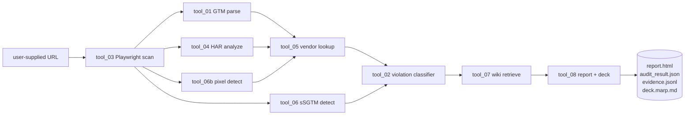

# End-to-end scenarios

> Load this at the start of every Claude Code session so the agent
> understands the full audit flow. Same pattern Fred Pike recommends in his
> "Consent Chaos" MeasureSummit talk.

## High-level

## Scenario A — clean OneTrust + Advanced Consent Mode

**Input**: a SaaS marketing site with OneTrust banner + GA4 + Advanced
Consent Mode V2 configured correctly.

**Flow**:
1. tool_03 opens the page with `OnetrustActiveGroups=C0001` (essentials
   only). Captures every outbound network request to `evidence.jsonl`.
2. tool_01 finds the GTM container ID in page HTML, intercepts `gtm.js`
   over the wire, parses it.
3. tool_04 inspects the HAR — sees `GCS=G100` in Google network requests,
   meaning Advanced Consent Mode is sending hashed signals.
4. tool_05 enriches every captured cookie + pixel with the vendor library.
5. tool_06 confirms there's a server-side container in front of GA4
   (cookieless first-party endpoint).
6. tool_06b finds no out-of-GTM pixels.
7. tool_02 classifies: no violations. S3 methodology → **definitive
   clean**.
8. tool_07 retrieves the relevant Consent Mode V2 + GCS wiki pages.
9. tool_08 produces a green report with the wiki context as legal backing.

**Output**: 1-page HTML report, "no violations", recommendation to keep
running the audit on a quarterly cadence.

## Scenario B — broken Consent Mode + tag fires post-reject

**Input**: an e-commerce site with OneTrust banner. Audit run with
`OnetrustActiveGroups=C0001` (rejected analytics + advertising).

**Flow**:
1. tool_03 captures every outbound request. Logs that a Meta Pixel call
   fired 1.2 seconds after page load, before user interaction.
2. tool_05 confirms `fbevents.js` is in the lawsuit-annotated vendor
   library — flagged as `category=advertising` with a Meta Pixel CIPA
   precedent.
3. tool_06 finds no server-side GTM in front of it — this firing is
   client-side and the consent enforcement code should have blocked it.
4. tool_02 classifies: **C0004 violation, definitive (S3 methodology),
   per-firing CCPA exposure $7,500**.
5. tool_07 pulls the wiki pages on CCPA enforcement, the Meta Pixel
   lawsuit surge, and recommended remediation patterns.
6. tool_08 produces a report leading with the financial exposure
   estimate, the network evidence (timestamps + endpoint + payload), and
   the remediation roadmap.

**Output**: a report that survives legal scrutiny because the audit ID,
timestamps, and network capture are all preserved.

## Scenario C — Server-Side GTM gap

**Input**: a B2B SaaS site with sSGTM running in front of analytics.
User opt-out at the banner does not propagate to the server-side container
(common misconfiguration).

**Flow**:
1. tool_03 captures requests. Sees outbound to `gtm.<customer-domain>.com`
   even after reject.
2. tool_06 detects sSGTM and flags that **client-side enforcement cannot
   block server-side firing** — the server is making the calls regardless.
3. tool_02 marks the finding as **server-side bypass, manual remediation
   required** (the engine cannot validate server-side behavior; it can
   only detect the gap).
4. tool_07 pulls the wiki page on sSGTM consent propagation requirements.
5. tool_08 surfaces this as a Tier-1 risk, since most enterprises don't
   audit sSGTM at all and only discover the gap during litigation.

**Output**: a focused report calling out the architectural gap with
remediation patterns (server-side consent forwarding via custom HTTP
headers, opt-out propagation through the GTM Server container).

## Scenario D — chat over a completed audit

**Input**: user has an `audit_id` and a question.

**Flow**:
1. `consent-engine chat <audit_id>` loads `audit_result.json` +
   `evidence.jsonl` + every wiki page cited.
2. Claude conversation grounded in that context.
3. User asks: "Why did `pixel.advertising.com` fire at 1.4s when our
   banner says it should be blocked?"
4. Claude reads evidence.jsonl, finds the request, inspects the page
   timing context, references the relevant wiki page on tag ordering
   races, returns a grounded answer with line numbers from the evidence.

## Inputs / outputs reference

| Input | Source | Required? |
|---|---|---|
| URL | CLI / API | Yes |
| GTM container JSON export | optional upload | No (live interception is primary) |
| HAR file | optional upload | No |
| Custom vendor list overrides | `data/vendor_library/` | No (built-in covers 3,200+) |

| Output | File | Audience |
|---|---|---|
| Structured audit result | `audit_result.json` | machines, future tools |
| HTML report | `report.html` | implementer / engineering team |
| Marp slide deck | `deck.marp.md` | client / executive |
| Network evidence | `evidence.jsonl` | legal, downstream chat agent |
| Executive summary | embedded in report | CMO / privacy officer |
